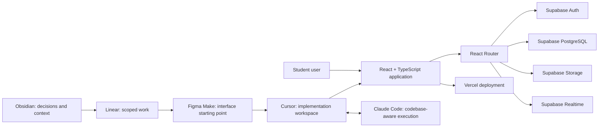
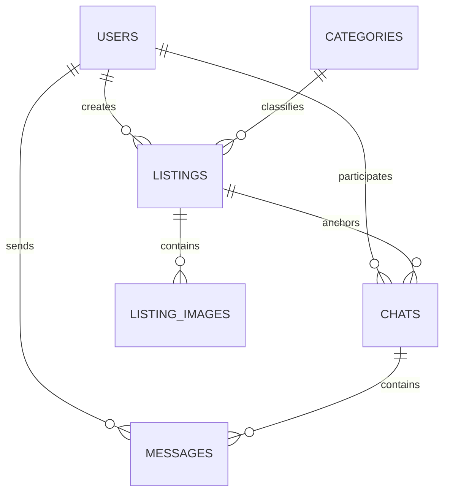

# StuffSycle

### A peer-to-peer marketplace for a university community


- **Status:** Shipped and deployed
- **Role:** Product Designer and Full-Stack Developer
- **Scope:** Research, product definition, UX/UI, application architecture, implementation, backend integration, and deployment
- **Live product:** [stuff-sycle-web-4.vercel.app](https://stuff-sycle-web-4.vercel.app/)
- **Context:** Bachelor project, European Humanities University, Vilnius, 2026

StuffSycle is a working web marketplace where university students can list, discover, discuss, and exchange things they no longer use. I built the project solo from the initial research question through a deployed application.

The key design problem was not adding marketplace features. It was making exchange between strangers predictable enough to complete. The product response was a bounded university community, identity tied to an educational email, and a short transaction path:

```text
List -> Find -> Message -> Hand over
```

## What shipped

- Authentication and account creation.
- University-oriented access and trust model.
- Searchable, filterable item catalog.
- Listing detail pages with price, condition, category, and delivery context.
- Create and publish listing flow with image handling.
- User profiles, listings, reviews, purchase, and sales views.
- Conversation list and direct messaging around an item.
- Favorites and notifications.
- FAQ, safety information, contact form, and live support surface.
- Administration surface for platform users and content operations.
- Responsive dark/light visual system.
- Public Vercel deployment backed by Supabase.

## Technology

| Layer | Technology | Responsibility |
|---|---|---|
| Interface | React 18, TypeScript | Component-based application and typed implementation |
| Build | Vite | Development and production build pipeline |
| Navigation | React Router | Nested application routes and route-oriented data flow |
| Forms | React Hook Form | Listing and authentication input workflows |
| Styling | Tailwind CSS, reusable UI components | Responsive interface and design system |
| Motion | Framer Motion | Transitions and interaction feedback |
| Backend | Supabase | Auth, PostgreSQL database, Storage, and Realtime |
| Deployment | Vercel | Hosted production build |
| Product context | Obsidian | Research, decisions, architecture, and project memory |
| Planning | Linear | Backlog, scope, milestones, and implementation tasks |
| Interface acceleration | Figma Make | Initial interface generation and exploration |
| Implementation | Cursor | Main repository workspace, integration, debugging, and deployment control |
| Codebase-aware AI | Claude Code | Scoped implementation, refactoring, review, and documentation support |

## System architecture



The application is organized around domain routes rather than a collection of disconnected screens. Authentication, discovery, selling, messaging, user account, support, and administration have explicit route boundaries. Supabase provides the backend services while Vercel hosts the client application.

[Read the detailed architecture](docs/architecture.md)

## Product and UX decisions

### Trust is part of the system boundary

Generic marketplaces optimize for reach. StuffSycle narrows access to a university community so identity and social context exist before a conversation begins. The educational-email entry point is therefore both an authentication rule and a product decision.

### Communication belongs inside the transaction

Listings and messaging share the same product context. A student can move from discovery to a conversation without reconstructing the item, seller, or exchange conditions in another application.

### The flow ends with a real-world handover

StuffSycle does not treat publication or messaging as the end state. The system is designed around a completed exchange: discovery, agreement, and physical handover.

[Read the product and UX case](docs/product-and-ux.md)

## Interface

### Catalog and discovery


### Item detail


### Messaging


### User profile


### Create a listing


### Support and administration

| Support | Administration |
|---|---|
|  |  |

## AI-assisted delivery without disposable code

StuffSycle used AI tools as a coordinated delivery system:

1. **Obsidian** held research, requirements, user flows, architecture, backlog context, and decisions outside chat.
2. **Linear** turned the product model into bounded tasks and milestones.
3. **Figma Make** accelerated the initial interface and gave implementation a concrete starting point.
4. **Cursor** was the primary code workspace for integration, debugging, local verification, and deployment commands.
5. **Claude Code** worked against the repository context for implementation, refactoring, code review, and documentation.
6. **Supabase** supplied the persistent backend: Auth, PostgreSQL, Storage, and Realtime.
7. **Vercel** hosted the production application; deployment was initiated and monitored from the Cursor workflow.

The product and architecture decisions remained human-owned. Generated output was treated as a draft to integrate, inspect, and test - not as an authority.

[Read the detailed delivery workflow](docs/delivery-workflow.md)

## Data model

The core model separates identity, content, media, and communication:



Primary entities:

- `users`
- `categories`
- `listings`
- `listing_images`
- `chats`
- `messages`

Ownership rules keep listing mutations with the seller, while messaging is scoped to conversation participants. Images are stored separately from listing records so content data and media lifecycle do not become one object.

## Evidence and availability

This repository is a public engineering case study, not the application source repository. It contains a curated explanation of the shipped system, interface captures from the working product, and architecture derived from the project documentation.

Available evidence:

- [Live deployed application](https://stuff-sycle-web-4.vercel.app/)
- Four-minute recorded product walkthrough
- [43-page bachelor project](docs/StuffSycle-bachelor-project.pdf) covering research, design decisions, information architecture, application architecture, and the implemented interface
- Separate application architecture, backlog, user flow, user journey, and route-structure artifacts

[Read the evidence notes](docs/evidence.md)

## Repository map

```text
.
├── README.md
├── assets/
│   └── screenshots/
├── docs/
│   ├── architecture.md
│   ├── delivery-workflow.md
│   ├── evidence.md
│   ├── StuffSycle-bachelor-project.pdf
│   └── product-and-ux.md
└── NOTICE.md
```

## Author

**Georgy Pevchikh**

[Upwork](https://www.upwork.com/freelancers/~01c6b4199075060eea) · [LinkedIn](https://www.linkedin.com/in/georgy-pevchikh-b84967406/) · [GitHub](https://github.com/georgypevchikh)
