<div align="center">

# StuffSycle

### A shipped peer-to-peer marketplace for a university community

**Research → product strategy → UX/UI → system architecture → implementation → deployment**

[](https://stuff-sycle-web-4.vercel.app/)
[](docs/StuffSycle-bachelor-project.pdf)
[](https://react.dev/)
[](https://supabase.com/)
[](https://stuff-sycle-web-4.vercel.app/)

**Designed and built independently by [Georgy Pevchikh](https://github.com/georgypevchikh).**

</div>

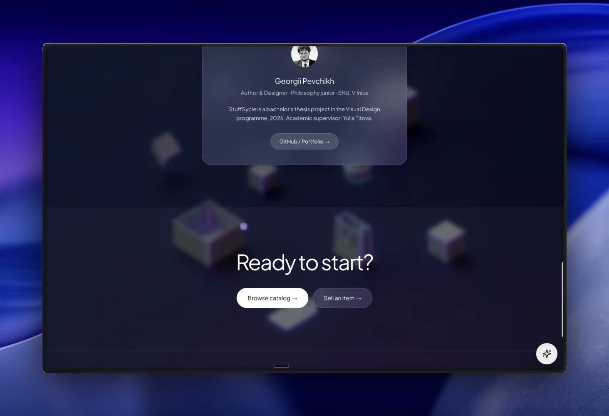

## The project in one sentence

StuffSycle is a working marketplace where university students can list, discover, discuss and exchange things they no longer use — built solo from the research question through a deployed React application.

| | |
|---|---|
| **Status** | Shipped and publicly deployed |
| **Role** | Product Designer + Full-Stack Developer |
| **Scope** | Research, product definition, UX/UI, architecture, implementation, backend integration and deployment |
| **Context** | Bachelor project, European Humanities University, Vilnius, 2026 |
| **Product** | [Open the live application](https://stuff-sycle-web-4.vercel.app/) |
| **Research** | [Read the 43-page bachelor project](docs/StuffSycle-bachelor-project.pdf) |

## The actual design problem

The challenge was not adding another catalog to the internet. It was making a local exchange between strangers predictable enough to finish.

Generic marketplaces optimize for reach. StuffSycle narrows the system to a university community, where identity and social context exist before the first message. Discovery, seller context, negotiation and handover stay inside one continuous flow instead of being split across unrelated tools.

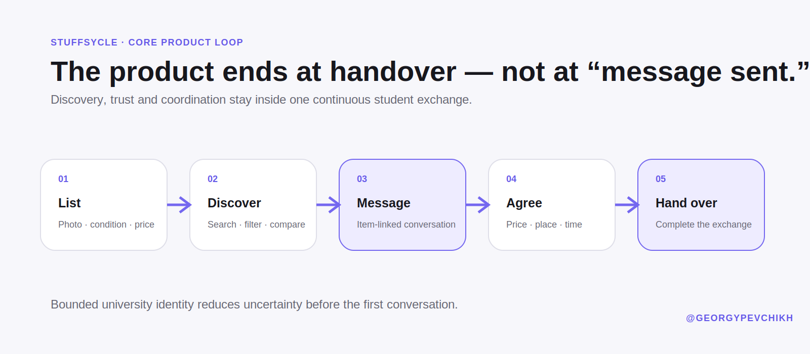

The product response combines three decisions:

- **Bounded identity:** educational context reduces uncertainty before users communicate.
- **Item-linked messaging:** every conversation retains the listing, seller and exchange context.
- **Real completion state:** success is a physical handover, not a published listing or sent message.

## What shipped

| Product area | Implemented behavior |
|---|---|
| Access and trust | Authentication, account creation and a university-oriented community model |
| Discovery | Searchable catalog, filters, sorting, categories, favorites and listing detail |
| Selling | Image handling, listing creation, validation, publication and seller management |
| Communication | Item-linked conversation list, direct messaging, notifications and Realtime updates |
| Identity | Profiles, listings, reviews, purchase history and sales views |
| Support | FAQ, safety information, contact flow and live support surface |
| Operations | Administration surface for users and marketplace content |
| Interface system | Responsive layouts, dark/light themes, reusable components and motion feedback |
| Delivery | Public Vercel deployment backed by Supabase |

## Product walkthrough

### Discover and compare

Search, filters and sorting remain close to the catalog, while seller and exchange detail appear only when the student opens a listing.

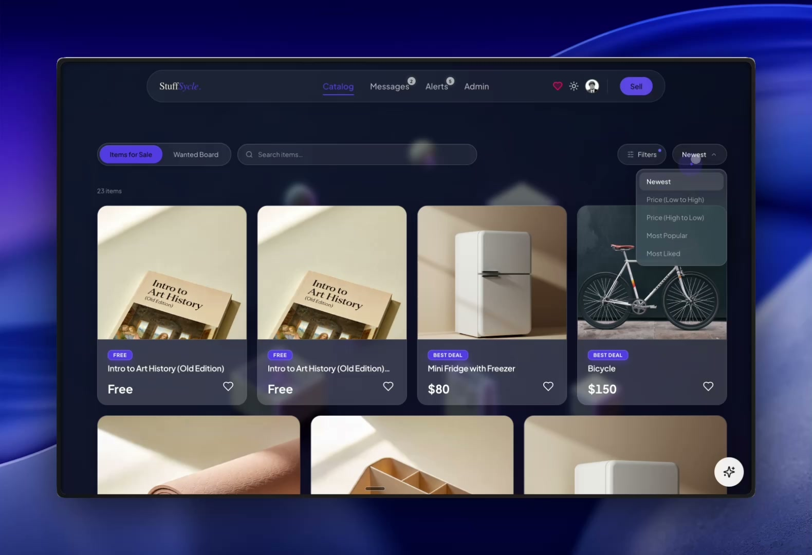

### Inspect the listing in context

The item page brings condition, category, price, seller and handover information together before asking the buyer to act.

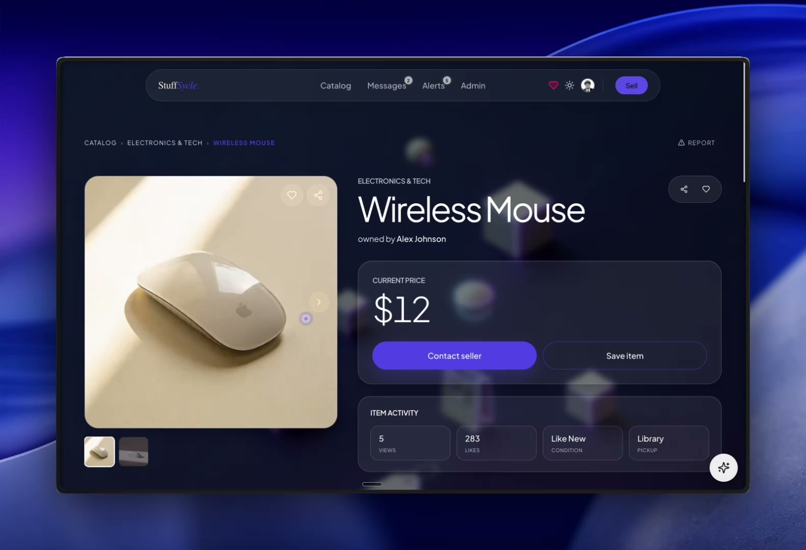

### Keep negotiation attached to the item

Messaging is a marketplace domain, not a detached chat feature. The thread retains the item and suggested negotiation prompts.

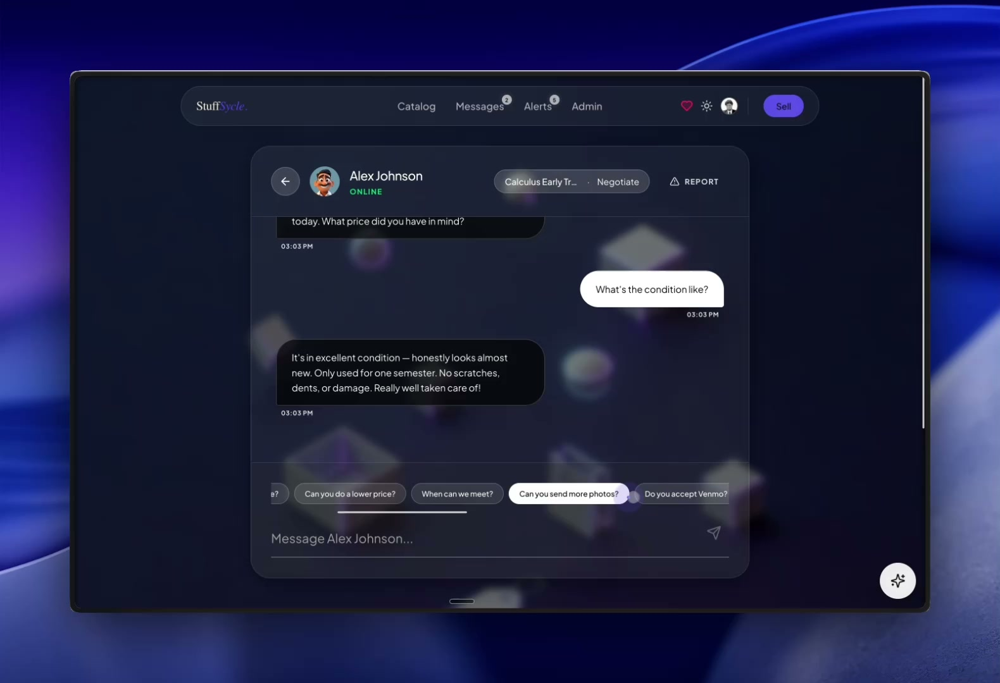

### Publish and manage supply

Listing creation treats photos, metadata, validation and publication as one transaction flow.

| Create a listing | Manage identity and activity |
|---|---|
| 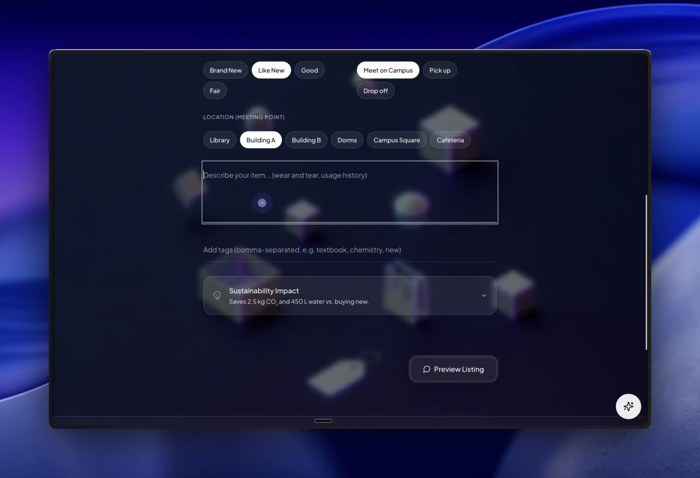 | 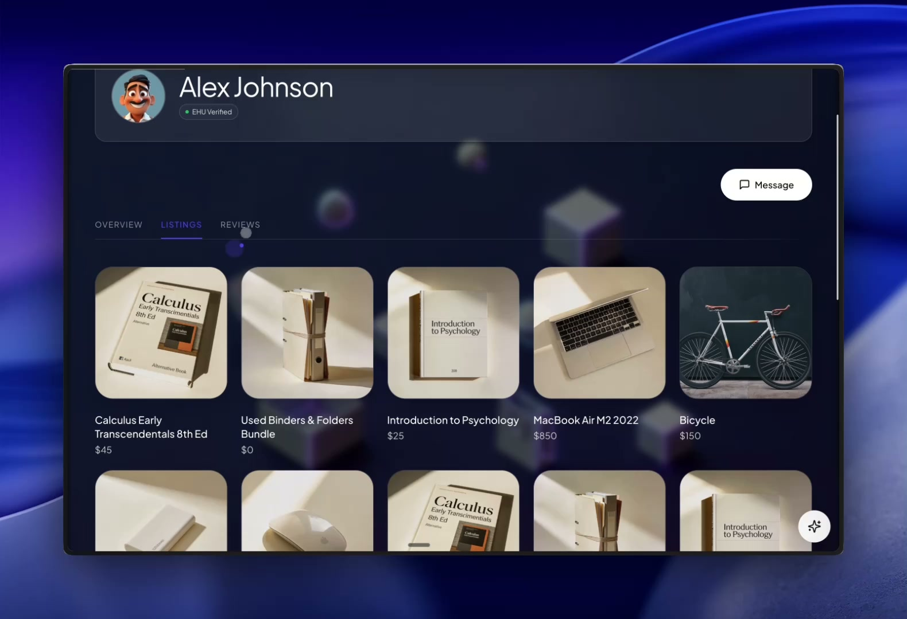 |

### Support the community and operate the platform

| Student support | Administration |
|---|---|
| 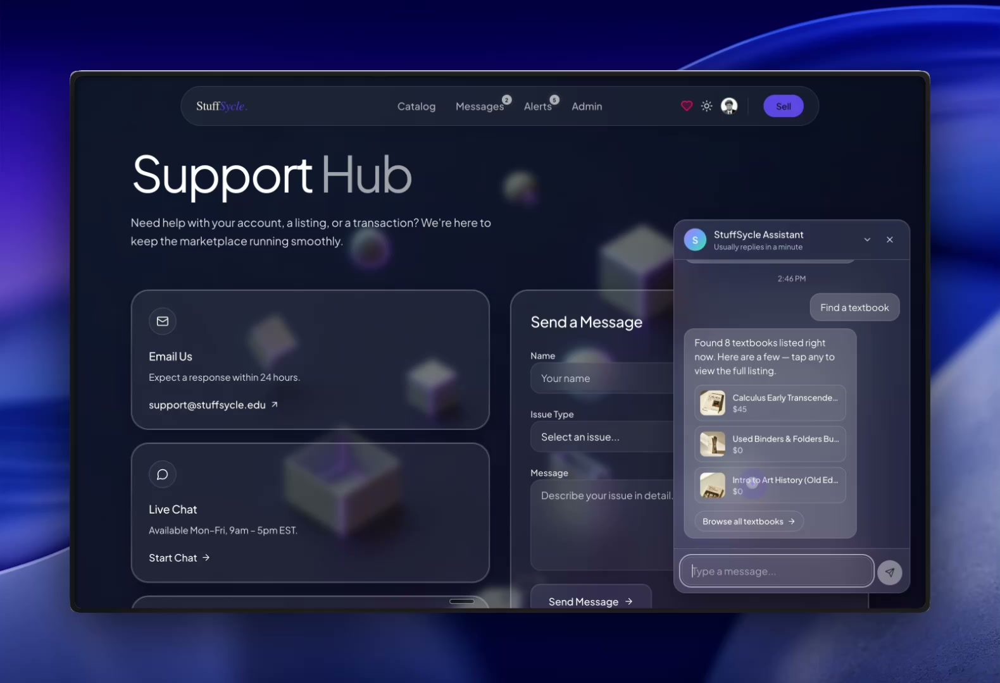 | 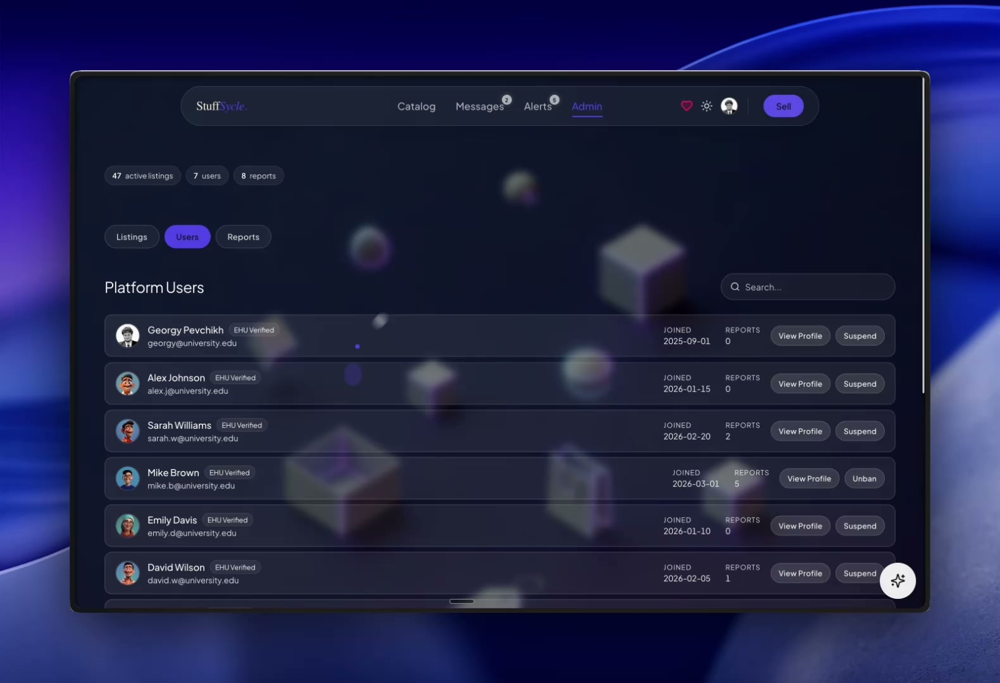 |

## Shipped system

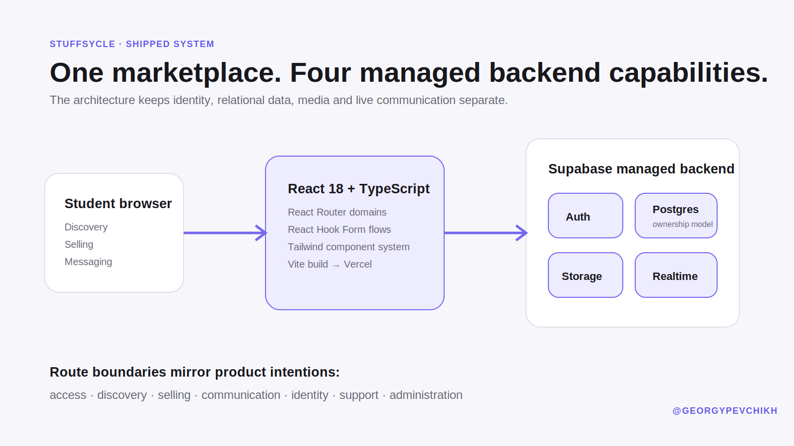

### Application layer

- **React 18 + TypeScript** for a component-based, typed interface.
- **Vite** for development and production builds.
- **React Router** for explicit domain routes: access, discovery, selling, messaging, identity, support and administration.
- **React Hook Form** for authentication and multi-step listing workflows.
- **Tailwind CSS** and reusable UI components for responsive dark/light presentation.
- **Framer Motion** for transitions and interaction feedback.

### Backend layer

- **Supabase Auth** for identity and sessions.
- **PostgreSQL** for profiles, categories, listings, images, chats and messages.
- **Supabase Storage** for listing media outside relational records.
- **Supabase Realtime** for live messaging updates.
- Ownership and participation rules designed close to the data boundary.

### Delivery layer

- **Git** as the executable source of truth.
- **Vercel** for the public production deployment.
- Deployment and production verification operated from the repository workflow.

[Read the detailed application architecture](docs/architecture.md)

## Data model

The model separates identity, marketplace content, media and communication:

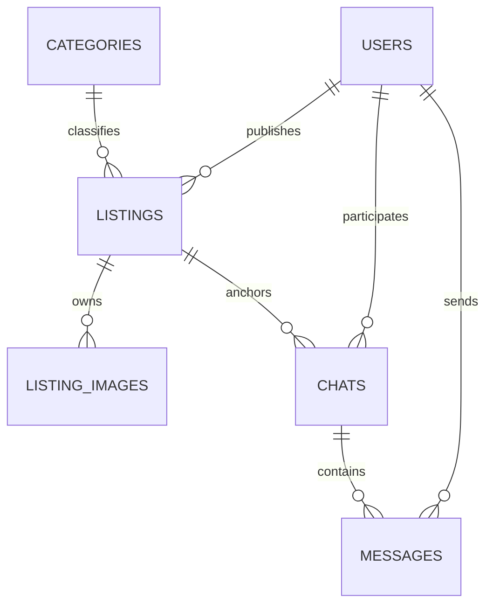

This separation matters operationally:

- image lifecycle does not overload listing metadata;
- a chat cannot lose the item that created it;
- seller ownership and conversation participation are explicit relations;
- Realtime accelerates communication without replacing Postgres as the source of truth.

## Product and UX decisions

### Trust is part of the system boundary

The university context is not a marketing label applied after the interface was designed. It changes access, identity, moderation expectations and the confidence required to arrange an in-person exchange.

### Roles are contextual

The same authenticated student may browse as a buyer, publish as a seller and later return to manage their activity. StuffSycle does not split one person into artificial buyer and seller accounts.

### Route structure follows user intent

Discovery, selling, messaging, account, support and administration have explicit route boundaries. Each domain owns its data needs, interaction states and permission expectations.

### Managed infrastructure was a deliberate trade-off

Supabase reduced infrastructure overhead while retaining real relational modeling, media storage, session management and live communication. Within an academic delivery window, a custom API server would have increased operational surface without improving the core exchange.

[Read the full product and UX case](docs/product-and-ux.md)

## AI-assisted delivery system

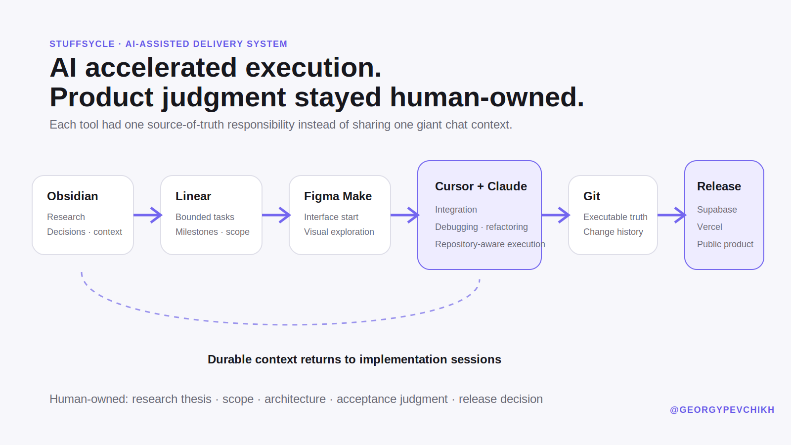

StuffSycle was not produced by a single prompt or a single tool. Each part of the workflow had a distinct responsibility:

| Tool | Source-of-truth responsibility |
|---|---|
| **Obsidian** | Research, product thesis, journeys, architecture, decisions and durable project context |
| **Linear** | Bounded implementation tasks, milestones and scope |
| **Figma Make** | Initial interface generation and visual exploration |
| **Cursor** | Primary repository workspace, integration, debugging and deployment control |
| **Claude Code** | Repository-aware implementation, refactoring, review and documentation |
| **Git** | Executable code state and change history |
| **Supabase** | Persistent authentication, database, media and Realtime behavior |
| **Vercel** | Production hosting and public delivery |

### Human-owned

- research question and product thesis;
- scope and prioritization;
- role model, user journeys and information architecture;
- trust model and system boundaries;
- interface direction and acceptance judgment;
- final integration and release decision.

### AI-assisted

- interface acceleration;
- bounded implementation work;
- codebase navigation and repetitive changes;
- debugging hypotheses and refactoring support;
- technical documentation drafting.

Generated output was treated as material to integrate, inspect and verify — never as the product authority.

[Read the detailed delivery workflow](docs/delivery-workflow.md)

## Evidence and claim boundaries

This is a public engineering and product case study, not a public source repository. The application source remains private; the shipped result and supporting evidence are deliberately inspectable.

| Claim | Status | Public evidence |
|---|---|---|
| Working web application | Confirmed | [Live Vercel deployment](https://stuff-sycle-web-4.vercel.app/) |
| End-to-end marketplace experience | Confirmed | Interface captures and recorded walkthrough |
| Research-led product rationale | Confirmed | [43-page bachelor project](docs/StuffSycle-bachelor-project.pdf) |
| React, TypeScript, Vite and Supabase architecture | Documented | Architecture artifacts and deployed bundle |
| Catalog, listings, profiles, messaging and administration | Confirmed | Working deployment and walkthrough captures |
| Solo product design and full-stack delivery | Project scope | Bachelor-project authorship and delivery history |
| Large-scale commercial production usage | **Not claimed** | Deployed bachelor product, not a scaled marketplace |
| Public application source | **Not available** | Private repository and configuration remain private |

The original product walkthrough is 4 minutes 3 seconds. Its 274 MB source is not stored here; the interface captures in [`assets/screenshots`](assets/screenshots) are extracted from that recording.

[Read the complete evidence notes](docs/evidence.md)

## Case-study map

```text
.
├── README.md                          Public case-study landing page
├── assets/
│   ├── diagrams/                      Shareable architecture and workflow visuals
│   └── screenshots/                   Frames from the shipped product walkthrough
├── docs/
│   ├── architecture.md                Runtime, routes, data and trade-offs
│   ├── delivery-workflow.md           Human + AI toolchain and ownership model
│   ├── evidence.md                    Proof matrix and explicit claim boundaries
│   ├── product-and-ux.md              Research, flows and interface principles
│   └── StuffSycle-bachelor-project.pdf 43-page academic project
└── NOTICE.md                          Copyright and reuse terms
```

## Author

<div align="center">

Built independently by **Georgy Pevchikh** — research, product strategy, UX/UI, system architecture, implementation, backend integration and deployment.

[Open the live product](https://stuff-sycle-web-4.vercel.app/) · [Read the bachelor project](docs/StuffSycle-bachelor-project.pdf) · [LinkedIn](https://www.linkedin.com/in/georgy-pevchikh-b84967406/) · [Upwork](https://www.upwork.com/freelancers/~01c6b4199075060eea)

</div>
