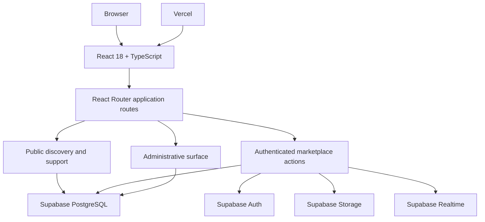
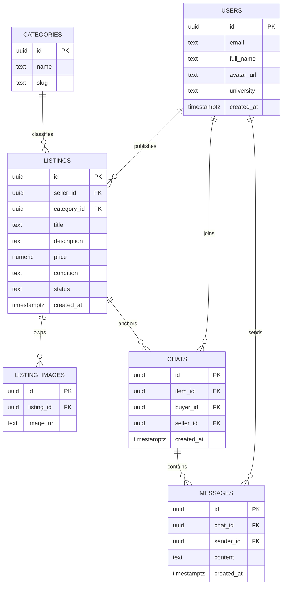
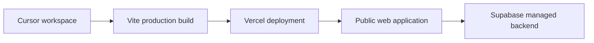

# Application architecture

## Architecture objective

StuffSycle had to support three connected domains without turning them into separate products:

1. discovering an item;
2. publishing and managing an item;
3. agreeing on an exchange through messaging.

The architecture keeps those domains explicit while sharing identity, navigation, visual primitives, and backend services.

## Runtime view

## Route boundaries

The interface is structured by domain rather than by arbitrary page order.

| Domain | Representative routes | Responsibility |
|---|---|---|
| Entry | `/`, `/login`, `/register` | Product entry, session creation, community access |
| Discovery | `/catalog`, `/product/:id` | Search, filters, listing detail, seller context |
| Selling | `/create-listing`, `/edit-listing/:id` | Draft, validate, publish, and manage a listing |
| Messaging | `/inbox`, `/chat/:id` | Conversations anchored to users and items |
| Account | `/profile`, `/profile/:id`, `/favorites`, `/my-listings` | Identity, reputation, listings, saved items, account history |
| System | `/notifications`, `/faq`, `/support` | Notifications, safety, help, and support |
| Administration | `/admin` | Platform user and content operations |

Authenticated routes protect actions that mutate user-owned data. The route structure also gives each product domain a clear place for its loading, error, and interaction states.

## Data model

The separation between `listings` and `listing_images` prevents item metadata and media lifecycle from becoming a single overloaded record. Chats are anchored to an item, so the negotiation always retains its marketplace context.

## Supabase responsibilities

### Authentication

Supabase Auth owns identity and session lifecycle. The interface uses the session to determine which actions are available and which routes require authentication.

The product-level trust rule is stricter than generic email login: the experience is designed around an educational email and a bounded university community.

### PostgreSQL

PostgreSQL stores user profiles, categories, listings, image records, conversations, and messages. Relational references preserve the connection between an item, its owner, its media, and conversations about it.

### Row Level Security

The permission model is designed around ownership and participation:

- a seller can create and manage their own listings;
- listing mutations are restricted to the listing owner;
- conversations are available to their participants;
- message creation is tied to the authenticated sender;
- administrative capabilities are separated from normal marketplace actions.

This keeps authorization close to the data instead of trusting a hidden button in the client.

### Storage

Listing media is stored outside the relational record. The database keeps image references, while the storage layer owns the binary objects.

### Realtime

Messaging uses realtime updates so a conversation can change without a full page reload. Realtime is scoped to communication; it is not used as a replacement for the relational source of truth.

## Client state

The project separates state by responsibility:

- authentication/session state;
- interface state such as theme, overlays, and toasts;
- route and server data loaded for the current product context.

Route-oriented data loading reduces the need for a large global store. Search state belongs in URL parameters where it can be refreshed, shared, and restored.

## Forms

React Hook Form manages client-side form state and validation. Listing creation follows an explicit sequence:

1. validate required metadata;
2. prepare or upload media;
3. create the listing record;
4. associate image records;
5. return the user to the published listing or their inventory.

The form is treated as a transaction flow, not only as a collection of inputs.

## Deployment boundary

The React application is built with Vite and deployed to Vercel. Supabase remains an independent managed backend.

Deployment commands and verification were run from the Cursor development workflow. Vercel is the hosting platform and deployment target.

## Deliberate tradeoffs

### Managed backend instead of a custom server

Supabase reduced authentication, database, storage, and realtime infrastructure while preserving a real Postgres data model. For the product scale and academic delivery window, a custom API service would have increased operational surface without improving the core exchange flow.

### Bounded community instead of open reach

Limiting the product to a university community reduces marketplace reach, but makes trust, moderation, and handover more tractable. This is a product architecture decision, not merely a marketing segment.

### Item-anchored messaging instead of generic chat

The conversation exists because of a listing. Keeping that relationship explicit reduces ambiguity and makes the path from discovery to agreement easier to understand.

## Source availability

The application source repository is private. This public case study documents the architecture and provides a working deployment without exposing private repository history or configuration.
