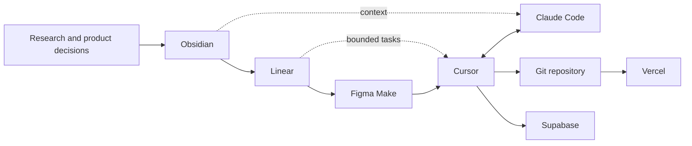

# AI-assisted delivery workflow

## Why the workflow matters

StuffSycle was built with several AI-assisted tools, but no single tool contained the whole project. Product decisions, task state, application code, backend data, and deployment each had a distinct source of truth.

That separation prevented two common failure modes:

- decisions disappearing inside chat history;
- generated code accumulating without scope, review, or architectural context.

## Toolchain



## Obsidian - project context and decisions

Obsidian held the durable project layer:

- problem framing;
- competitor and contextual research;
- user roles;
- user journeys and flows;
- backlog context;
- information architecture;
- application architecture;
- decisions and constraints.

This made project knowledge inspectable outside any AI conversation. A new implementation session could start from written context instead of reconstructing the product from memory.

## Linear - work decomposition

Linear translated the product model into work that could be completed and reviewed:

- product and research milestones;
- interface tasks;
- authentication and backend integration;
- catalog, listing, messaging, profile, support, and administration work;
- bug fixing and deployment tasks.

The important function of Linear was not project-management ceremony. It bounded each AI-assisted implementation request with an outcome and scope.

## Figma Make - interface starting point

Figma Make was used to accelerate interface exploration and produce an initial application surface. That output was a starting point rather than the final architecture.

The generated interface still required:

- product and route structure;
- component and state decisions;
- backend integration;
- authentication behavior;
- data modeling;
- responsive review;
- debugging and deployment.

## Cursor - implementation workspace

Cursor was the main repository workspace. It combined code editing, terminal access, local verification, source-control operations, integration work, and deployment commands.

Work performed from Cursor included:

- integrating the application structure;
- connecting Supabase services;
- debugging route, state, and UI behavior;
- reviewing and adjusting generated code;
- running the application locally;
- preparing and initiating Vercel deployment;
- checking the deployed result.

"Deployed through Cursor" means the deployment workflow was operated from Cursor; Vercel is the hosting platform and production target.

## Claude Code - repository-aware execution

Claude Code was used against the actual codebase rather than as a detached chat assistant. Its role included:

- implementing bounded tasks from project context;
- navigating and changing multiple related files;
- refactoring generated or duplicated structures;
- diagnosing integration problems;
- checking implementation against architecture and flows;
- producing and updating technical documentation.

Changes remained subject to human review and local verification.

## Supabase - backend system

Supabase supplied the persistent application layer:

- authentication and sessions;
- PostgreSQL data storage;
- listing image storage;
- realtime communication updates;
- ownership and access rules.

Using one managed backend reduced infrastructure overhead without removing the relational data model or database permission layer.

## Vercel - deployment target

Vercel hosts the public application. The deployment flow was:

```text
Repository state
-> local build and integration checks in Cursor
-> Vercel deployment
-> public deployment verification
-> application/back-end behavior check
```

## Division of responsibility

### Human-owned

- research question and product thesis;
- scope and prioritization;
- role model and user journeys;
- information and application architecture;
- trust model and access decisions;
- interface direction;
- acceptance judgment;
- final integration and release decision.

### AI-assisted

- interface generation;
- implementation acceleration;
- codebase navigation;
- repetitive changes;
- debugging hypotheses;
- refactoring assistance;
- documentation drafting and maintenance.

This distinction is important: the value of the workflow came from coordinating the tools around an explicit product model, not from asking one model to generate an application in a single prompt.

## Reusable operating principle

The workflow can be summarized as:

```text
Files hold durable context.
Tasks define bounded outcomes.
AI accelerates implementation.
Code remains the executable source of truth.
The developer owns judgment and release.
```
